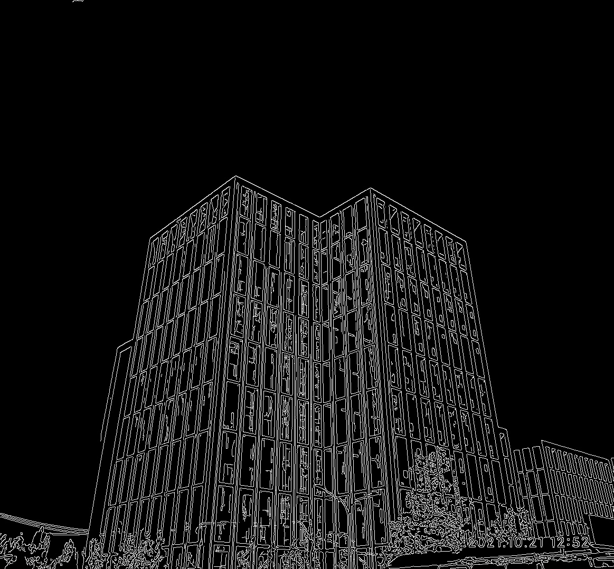
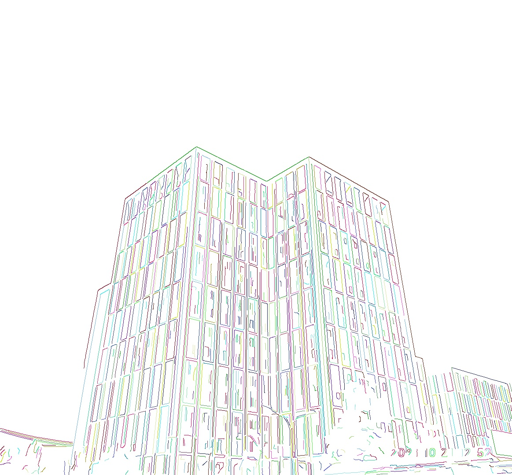
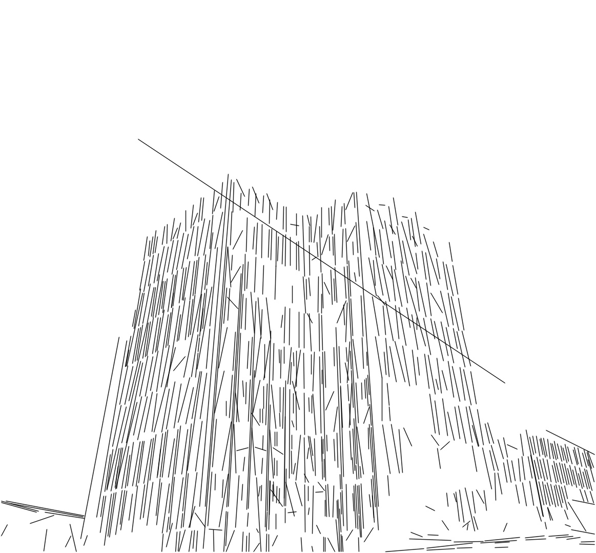
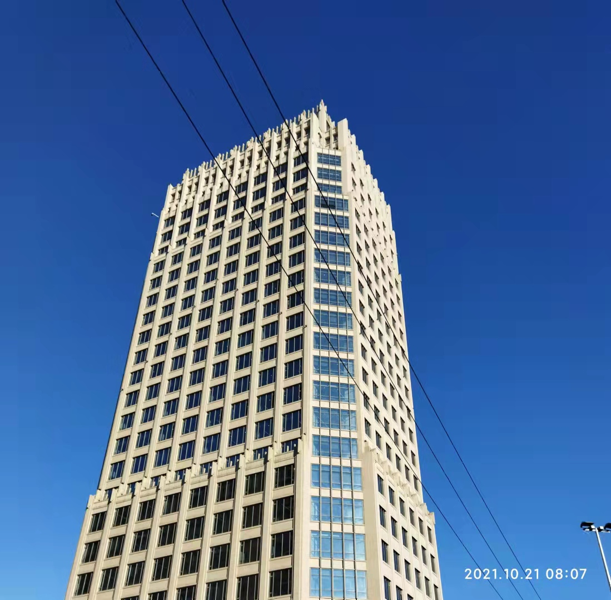
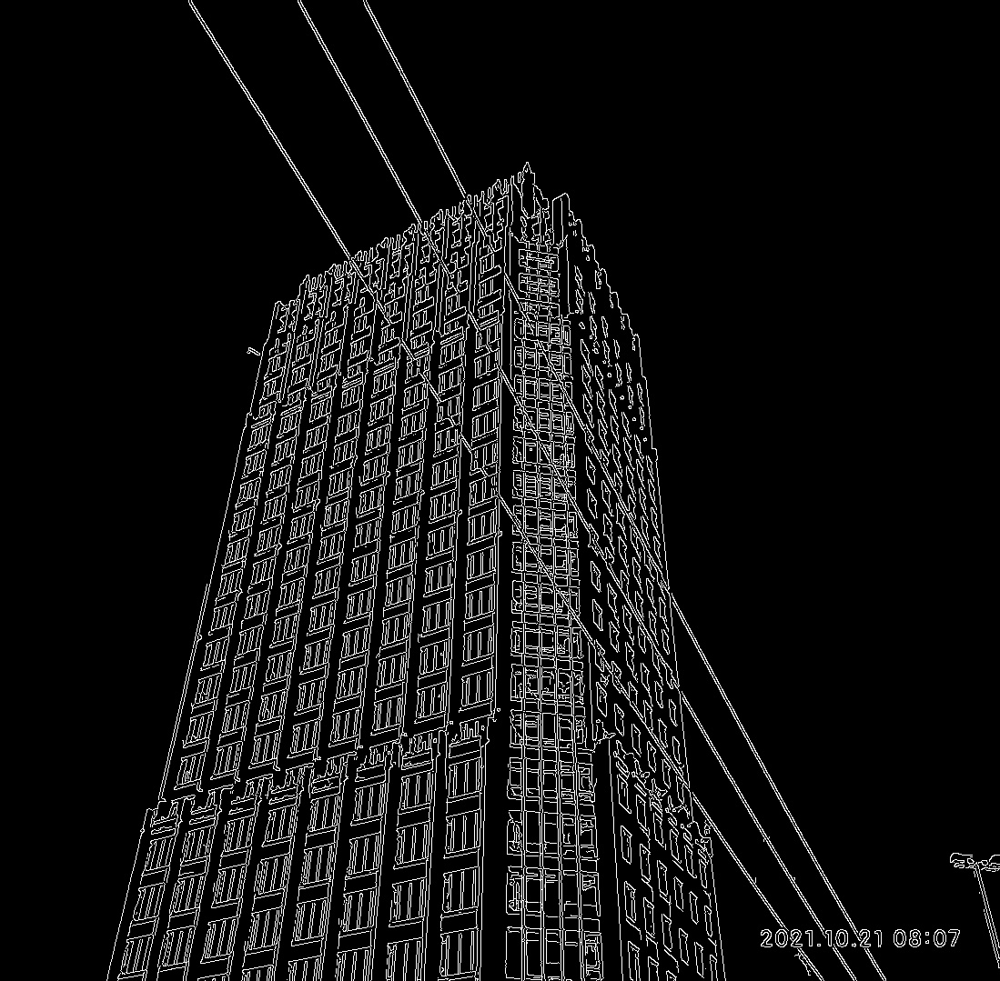
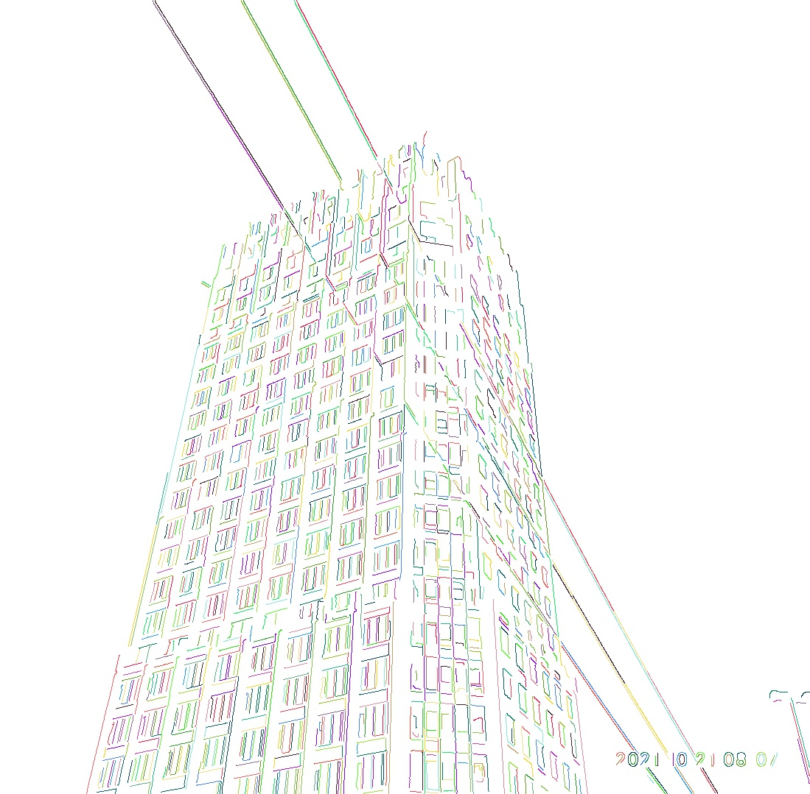
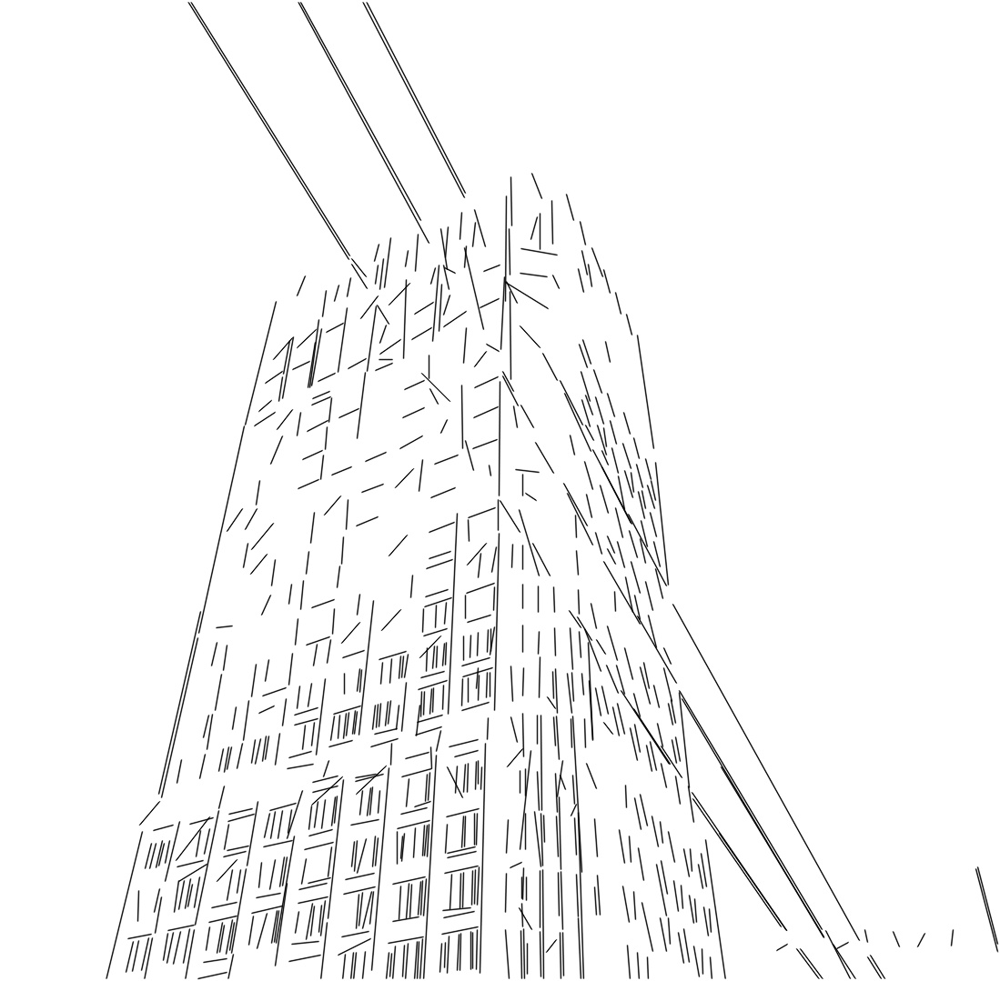

# Cannly Line

A Line Segment Extraction Toolbox

Authour: https://github.com/ludlows

| original image  | line extraction | colorized | line segments |
| :-------------: | :-------------: | :-------------: | :-------------: |
|    |    |  |  |
|    |    |  |  |

## Install

```
pip install https://github.com/ludlows/CannyLine/archive/refs/heads/master.zip
```

## Usage

### Colorizing Lines Segments

```python
from cannyline import CannyPF, comp_edge_chain, color_imwrite

img_path = "./img/test02.jpg"
img = cv2.imread(img_path, 0)
cannypf = CannyPF(3, 70, img)
edgemap = cannypf.comp_edge_map()
edge_chain = comp_edge_chain(img, edgemap)
shape = list(img.shape) + [3]
name = img_path.split(".")[:-1]
name = ".".join(name)
name += "-color-out.jpg"
color_imwrite(edge_chain, shape, name)
```

### Extracting Lines

```python
from cannyline import MetaLine
img_path = "./img/test02.jpg"
img = cv2.imread(img_path, 0)
mtline = MetaLine()
lines = mtline.mtline_detect(img, 8,1)
out = 255* np.ones(img.shape, dtype=np.uint8)
for start_x, start_y, end_x, end_y, _ in lines:
    cv2.line(out, (int(start_x), int(start_y)), (int(end_x), int(end_y)), (0,0,0),thickness=1, lineType=cv2.LINE_AA)
name = img_path.split(".")[:-1]
name = ".".join(name)
cv2.imwrite(name + "-out1.jpg", out)
mtline.getInfo(img,1,1,0.125)
cv2.imwrite(name + "cannypf.jpg", mtline.canny_edge)
```
